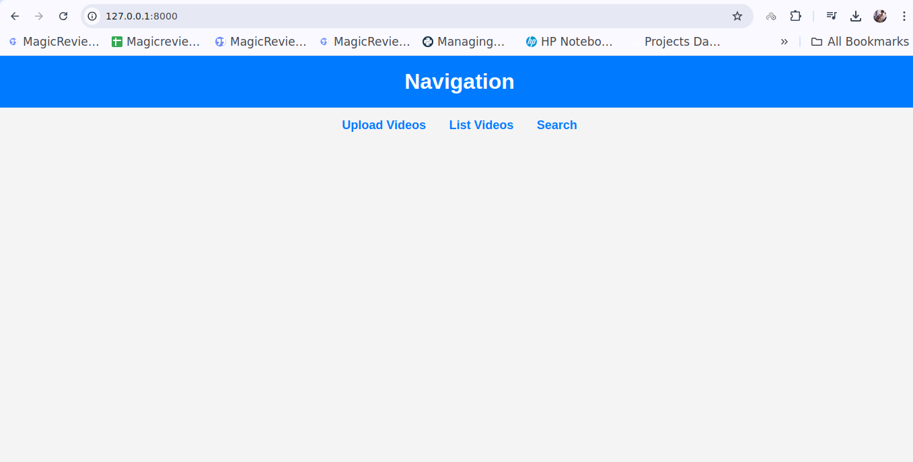
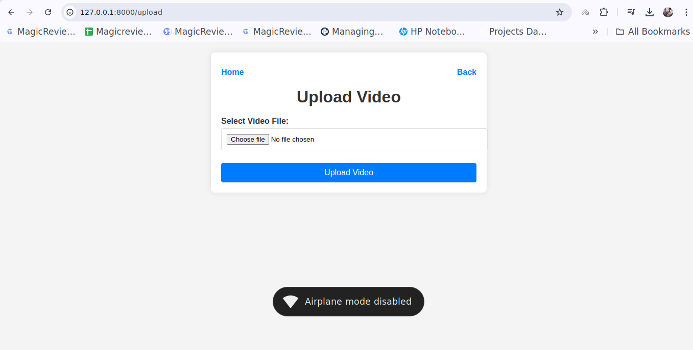
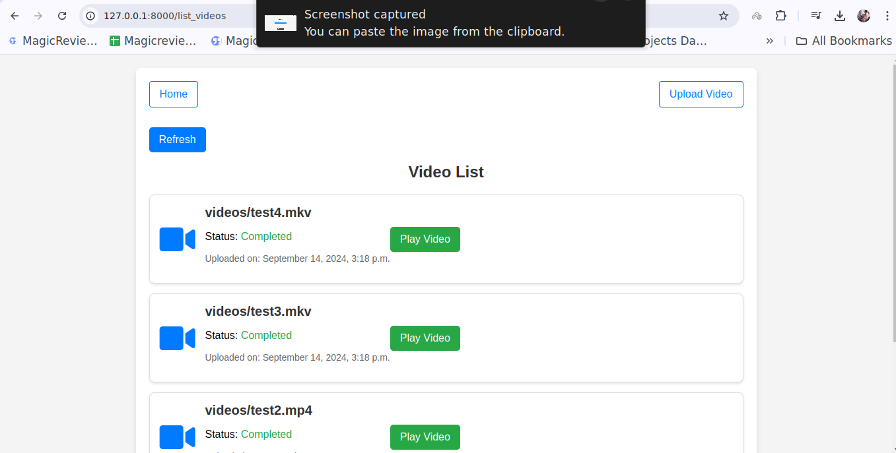
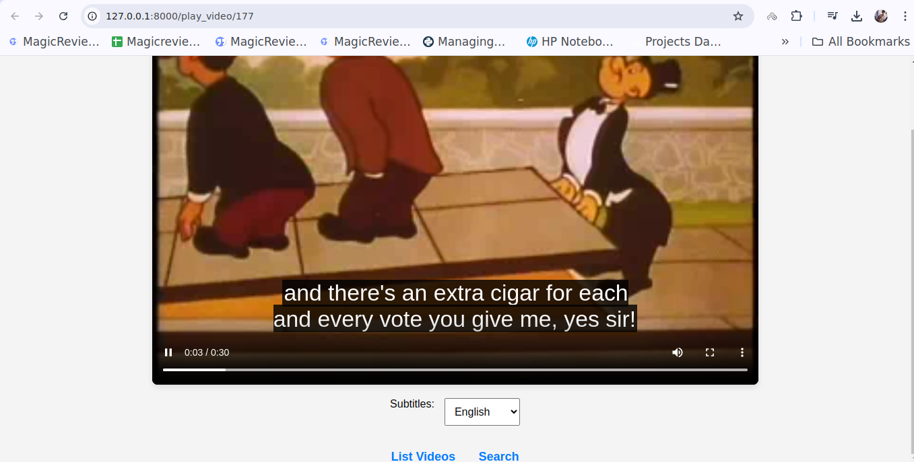
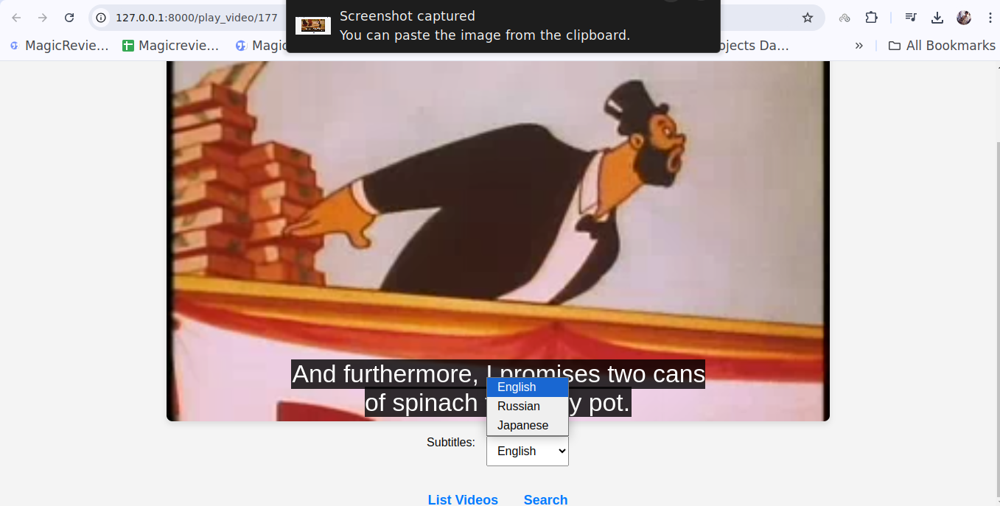
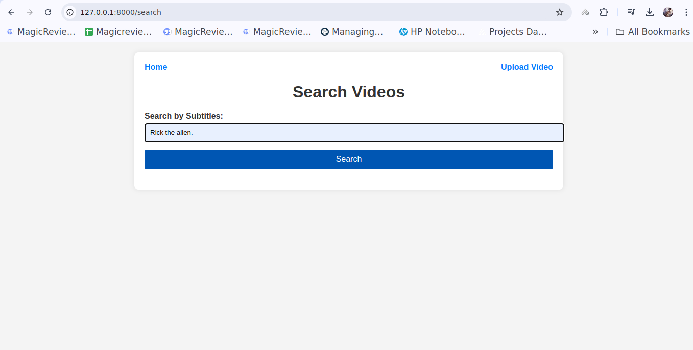
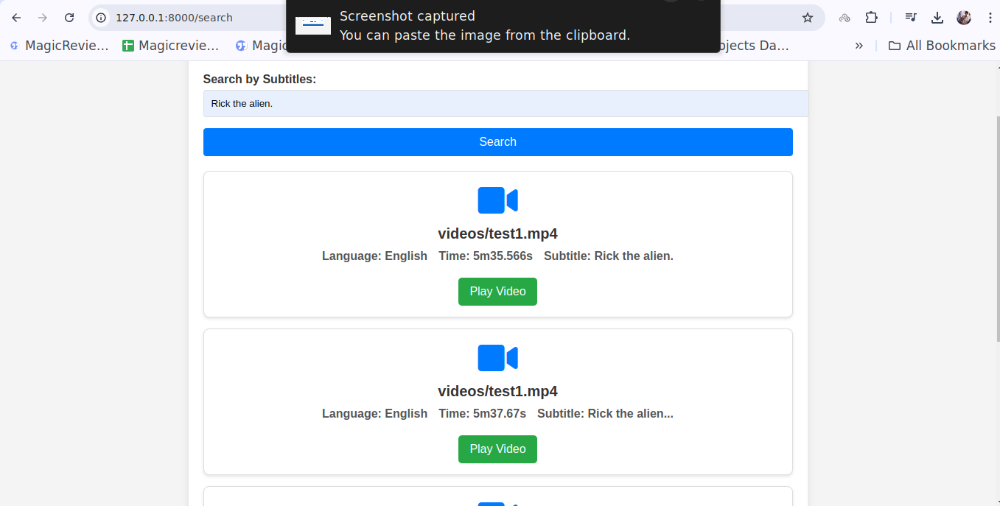
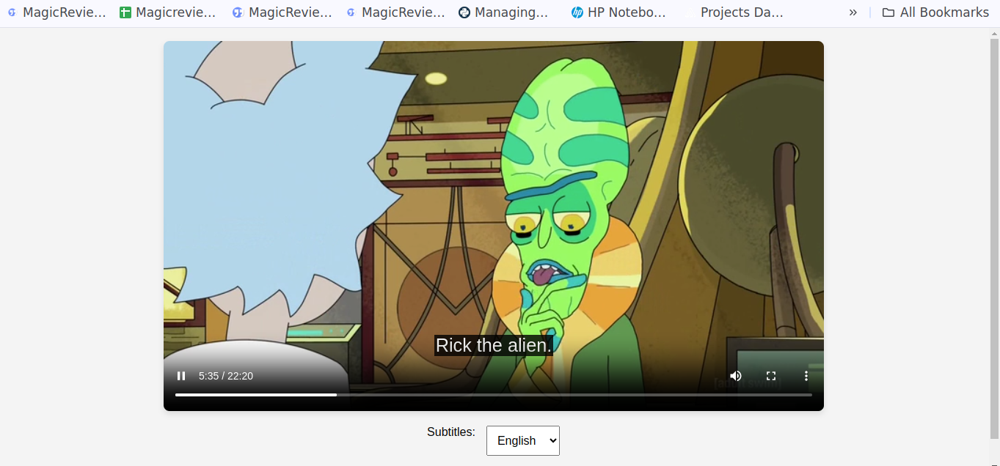

# Fatmug

## Getting Started

### Cloning the Repository

To get started, clone the repository with the following command:

```bash
git clone https://github.com/Yyuichiii/Fatmug.git
```

### Running the Docker Container

Build and start the Docker containers with:

```bash
docker-compose up --build
```

This command will build the containers and run the web development server at [http://localhost:8000](http://localhost:8000). The setup includes Docker, Redis, and PostgreSQL images.

### Creating a Superuser

To create a superuser, run:

```bash
docker-compose exec web python /app/fatmug/manage.py createsuperuser
```

### Project Overview

Once the server is running, you will see the home page with three options to navigate:

1. **Upload Videos**
2. **List Videos**
3. **Search**

#### Home Page Screenshot



#### Upload Videos

On the "Upload Videos" page, you can upload video files. After uploading, you are redirected to the "List Videos" page. The videos are uploaded but not immediately processed. Background extraction tasks are handled using Celery with FFmpeg.

The process involves:

1. Using `ffprobe` to identify subtitle streams in the uploaded video.
2. If subtitles are present, FFmpeg extracts them.
3. The `langdetect` library determines the language of the VTT file.
4. Subtitle files are saved both in the media directory and as text in another model for searching.

#### Upload Videos Screenshots




#### List Videos

When the "Refresh" button is clicked, the status of videos changes from "Pending" to "Completed," and a "Play Video" button is displayed.

#### Video Playback Screenshots




#### Search Functionality

On the "Search" page, you can search for words or sentences. The backend searches through the subtitles of the uploaded videos in any language. Search results are displayed below the search bar via AJAX. Clicking on the "Play" button will start the video from the point where the subtitle appears, showing the subtitles in the searched language.

#### Search Screenshots





### Video Demo

A video demonstration of the entire project is available here:

[Fatmug VideoCast](Screenshots/Fatmug&VideoCast.webm)

